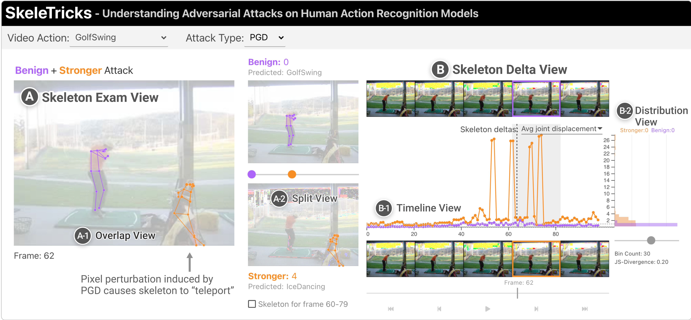

# SkeleTricks
An interactive system for visualizing and deciphering adversarial attacks on human action recognition models to help enhance human understanding of attacks.

## Live Demo
For a live demo with no installation needed, visit https://poloclub.github.io/skeletricks/



## Running Locally
Clone or download this repo
```
git clone git@github.com:poloclub/skeletricks.git
```

Setup NPM and install its dependencies
```
npm init
npm install
```

Run SkeleTricks
```
npm run dev
```
Navigate to localhost:5000 in your web browser and you should see SkeleTricks running!

## Code Structure

The project is structured as follows:
```
├── public
│   ├── favicon.png
│   ├── index.html
│   ├── global.css
│   ├── nouislider.css
│   ├── patch_interpolated_data
│   │   ├── item-<dataID>
│   ├── pgd_interpolated_data
│   │   ├── item-<dataID>
│   └── build
│       ├── bundle.css
│       ├── bundle.css.map
│       ├── bundle.js
│       └── bundle.js.map
│
└── src
    ├── App.svelte
    ├── main.js
    ├── OverlapView
    │   ├── OverlapView.svelte
    │   └── OverlapView.js
    ├── SeparateView
    │   ├── SeparateView.svelte
    │   └── SeparateView.js
    ├── FrameView
    │   ├── FrameView.svelte
    │   └── FrameView.js
    └── DistributionView
        ├── DistributionView.svelte
        └── DistributionView.js
```
- ```src:``` This directory is where the source code for the interface
  - ```App.svelte:``` This is the top-level component of the app. Please look at this file first to get a high-level idea about the whole structure. You should be able to see that each component (e.g., OverlapView) is imported from other svelte files.
  - ```main.js:``` This is the entry point to the applicatioin. It instantiates the App components and binds it to the body of our html page.

## Credits
SkeleTricks was created by [Megan Dass*](http://megandass.me/), [Haekyu Park*](https://haekyu.com/), Zhiyan Zhou*, [Nilaksh Das](http://nilakshdas.com/), Sushanto Praharaj,  Aiswarya Bhagavatula, [Zijie J. Wang](https://zijie.wang/), Anindya S. Paul, [Duen Horng (Polo) Chau](https://www.cc.gatech.edu/~dchau/), which was the result of a research collaboration between Georgia Tech and Intel.

(* Equal contribution)

## License
The software is available under the [MIT License](https://github.com/poloclub/skeletricks/blob/main/LICENSE).

## Contact
If you have any questions, feel free to [open an issue](https://github.com/poloclub/skeletricks/issues/new/choose) or contact [Megan Dass](mailto:mdass3@gatech.edu).
